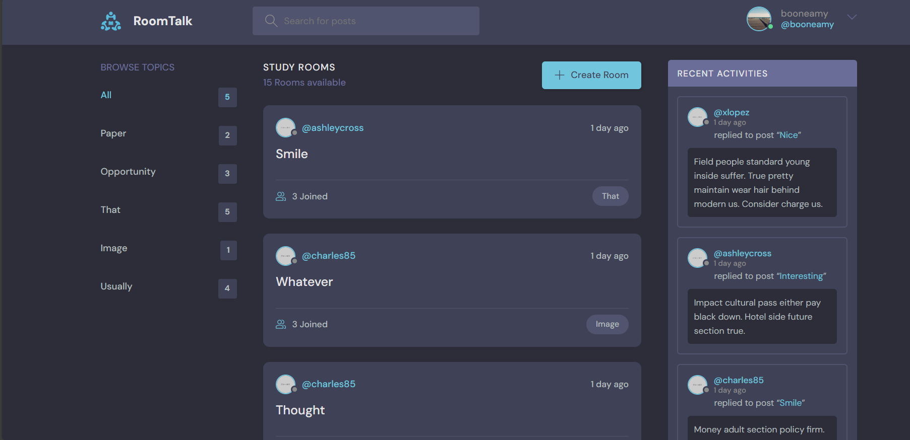
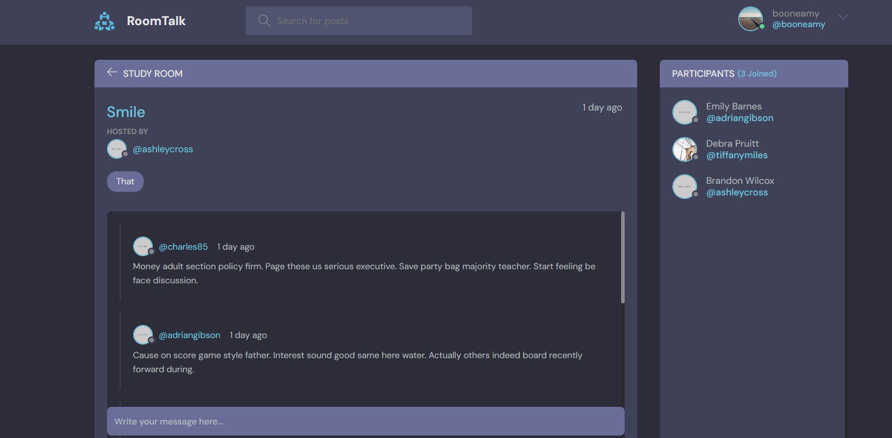
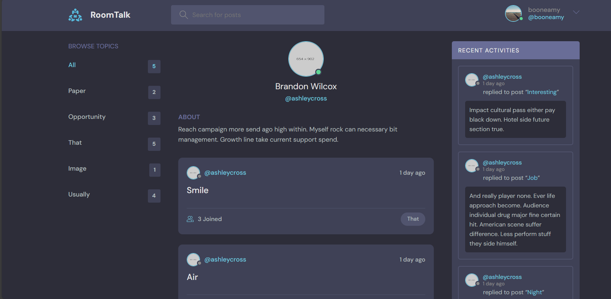

# RoomTalk_project

This is a Django-based forum application built to demonstrate fundamental concepts of web development using Django. The project allows users to register, log in, create rooms, post messages, and interact with other users. It also includes user profiles and room/topic management features.

## Features

- **User Authentication**: Users can register, log in, and log out of the platform.
- **Room Management**: Users can create, update, and delete rooms. Rooms are organized by topics, allowing users to categorize their discussions.
- **Message Posting**: Users can post messages within rooms, and interact with messages from other users.
- **User Profiles**: Each user has a profile where they can see their rooms, messages, and interactions across the platform.
- **Topic Browsing**: The platform allows users to browse rooms based on specific topics and view popular discussions.
- **Activity Feed**: A feed of recent activity, including messages and room interactions, is displayed to help users stay updated on the latest discussions.

## Description

This project demonstrates a fully functional Django application with essential features such as authentication, database models, and interaction between models. The rooms are tied to specific topics, which help in categorizing and organizing discussions. 

Additionally, the project is designed with scalability in mind, with room and message creation handled dynamically based on user input. The code is optimized for performance, making use of `select_related` and `prefetch_related` to reduce the number of database queries.

The project showcases how Django can be used to build a social platform with features like messaging, user interaction, and content management. It also includes some common patterns such as login-required views, form handling, and querying related data.

## Screenshots of Functionality

### 1. Home Page with Rooms and Topics
The home page displays a list of rooms and topics for users to explore.

### 2. Room Page with Messages
Users can see all messages posted in a room and interact with them.

### 3. User Profile
Each user has a profile displaying their rooms, messages, and interactions.

## Note

This repository is based on a YouTube course by Traversy Media available at [Python Django 7 Hour Course](https://www.youtube.com/watch?v=PtQiiknWUcI&list=PLillGF-RfqbbJYRaNqeUzAb7QY-IqBKRx&index=18). The code and features are built following the lessons from that course.
